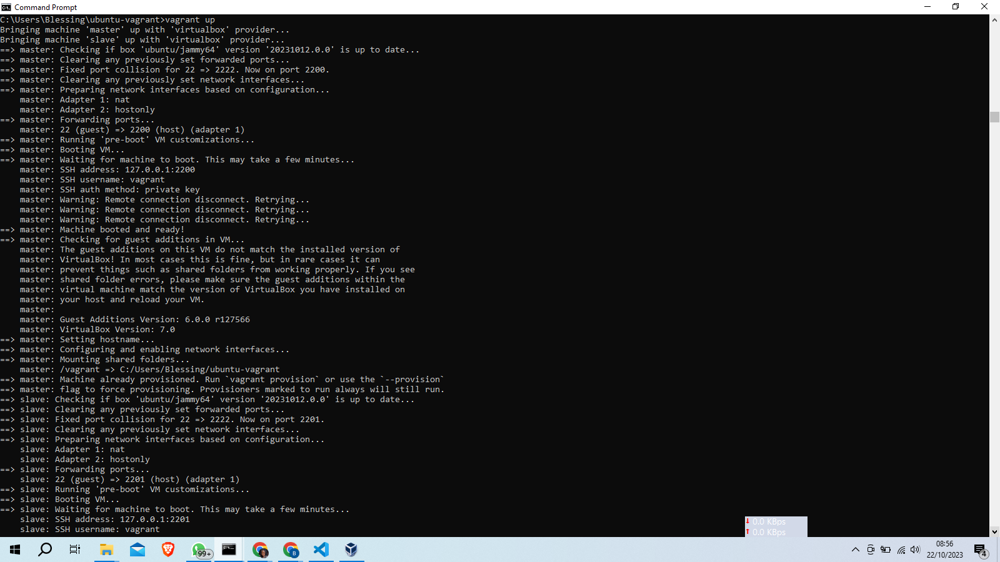
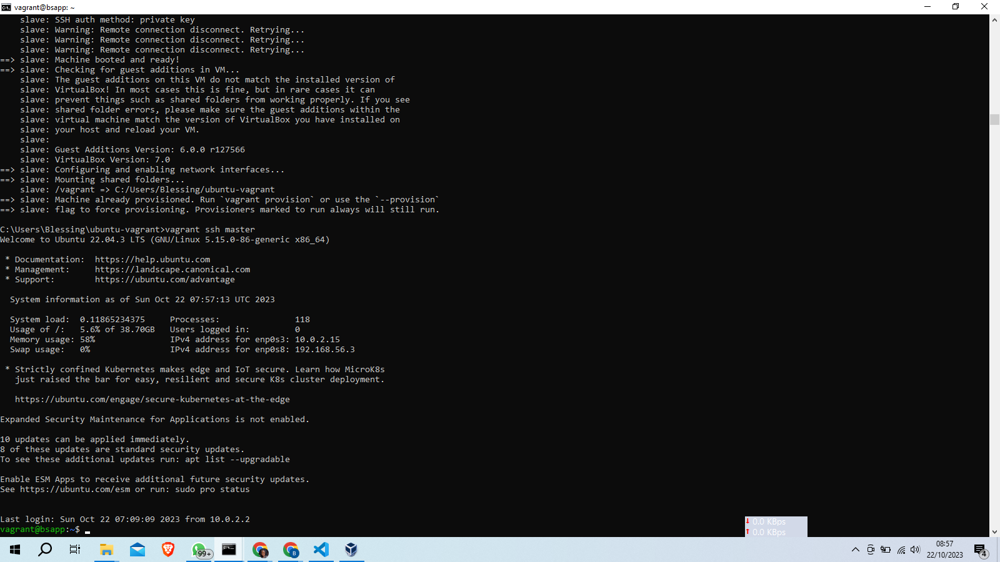
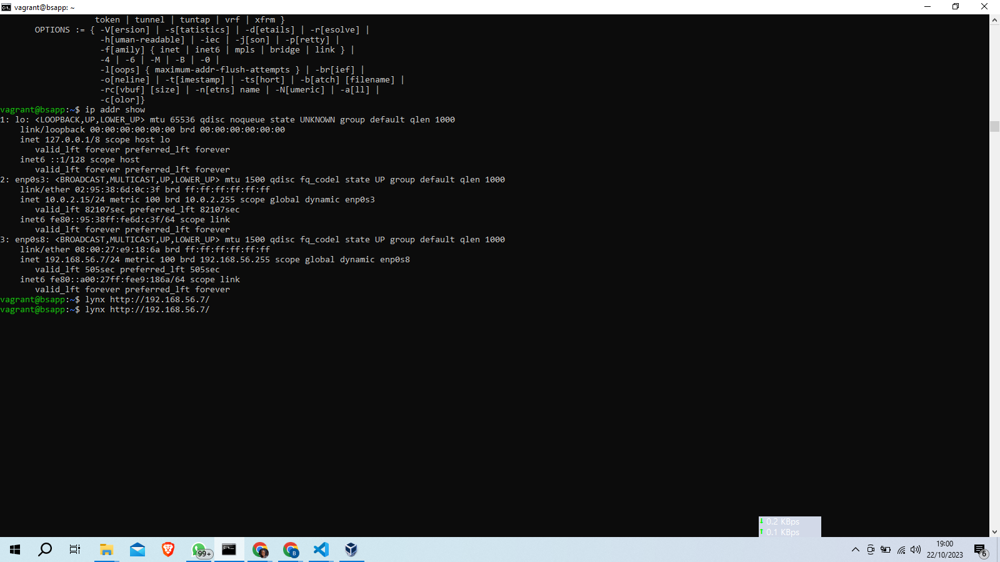
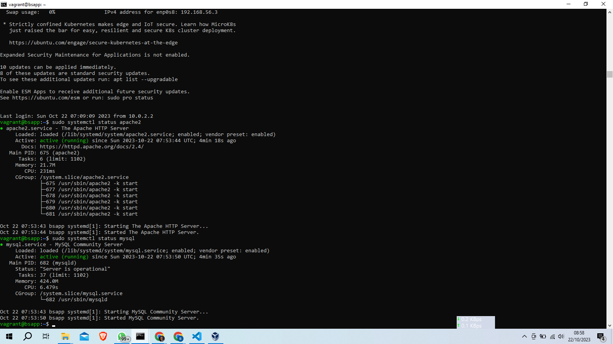
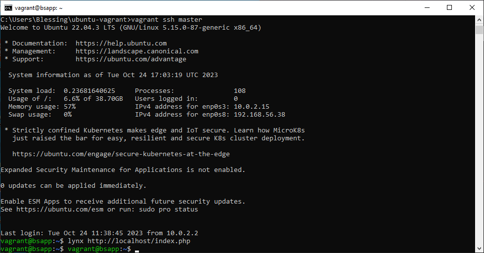
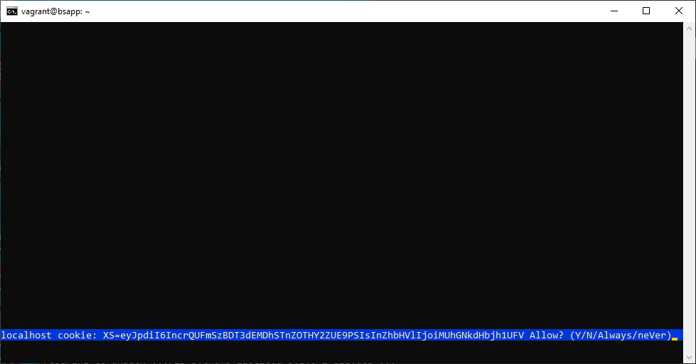
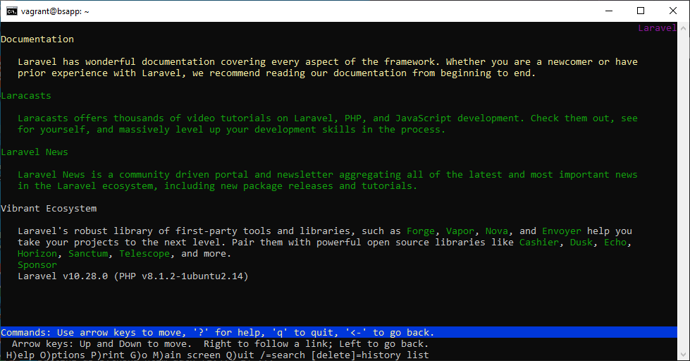
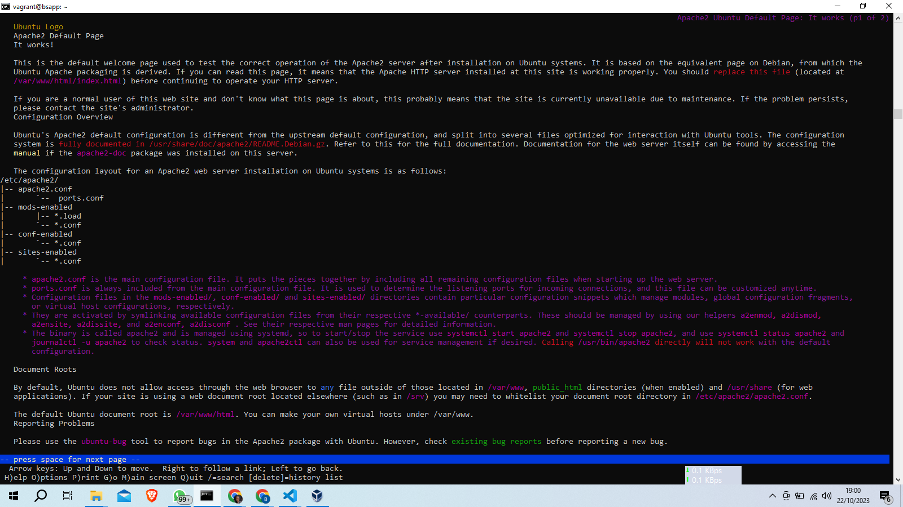

# Step 1: Create Master and Slave with vagrant

I created master and slave VM using the Vagrant File

# Step 2: SSH into Master

I used the command "vagrant ssh master"

# Step 3: Get IP address
I used the command "ip addr"

# Step 4: Verivy Bash Script for Provisioning works

I used the command "sudo systemctl status apache2" and "sudo systemctl status mysql" 

# Step 5: Deploy PHP App
First, i ran the command "lynx http://localhost/index.php" or "lynx http://192.168.56.38/index.php"

